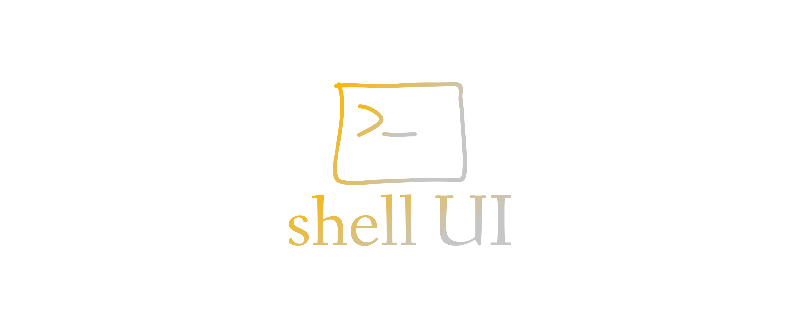
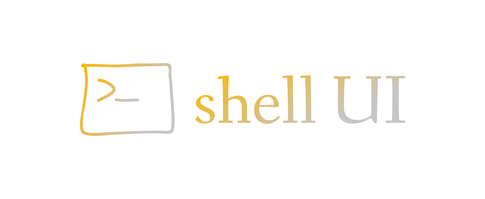

# logo.shellui.com


## [logo.shellui.com](http://logo.shellui.com/)

http://logo.shellui.com/


shellui 


# Color
+ #FF9302
+ #000000
+ #FFFFFF

# Font 1
Font in use Signika-Regular designed by Anna Giedryś and licensed under Open Font License. Icon Designed by Arsenty
+ Light
+ Regular
+ Semi-Bold
+ Bold

## url
Font in use <a target="_blank" href="https://fonts.google.com/specimen/Signika">Signika-Regular</a> designed by
<a target="_blank" href="http://ancymonic.com/">Anna Giedryś</a>
and licensed under
<a target="_blank" href="http://scripts.sil.org/cms/scripts/page.php?site_id=nrsi&amp;id=OFL_web">Open Font License.</a>
Icon Designed by
<a target="_blank" href="https://thenounproject.com/arsenty">Arsenty</a>

# Font 2
https://parkingomat.github.io/logo/rounded-elegance/index.html

Font in use Rounded_Elegance designed by Genumano and licensed under 100% Free. Icon Designed by Arsenty

## url
https://www.dafont.com/rounded-elegance.font

Font in use <a target="_blank" href="https://www.dafont.com/rounded-elegance.font">Rounded_Elegance</a> designed by
<a target="_blank" href="mailto:dcc700@gmail.com">Genumano</a>
and licensed under
<a target="_blank" href="https://www.dafont.com/faq.php#copyright">100% Free.</a>
Icon Designed by
<a target="_blank" href="https://thenounproject.com/arsenty">Arsenty</a><
          
### css 
    p {
       font-family: 'Signika';
       font-weight: normal;
       font-style: normal;
    }


### html

    <link rel="stylesheet" media="screen" href="https://fonts.google.com/specimen/Signika" type="text/css"/>
    

## 1


## 2



---
+ [edit](https://github.com/shellui/logo/edit/main/README.md)

```
https://github.com/shellui/logo.git
```
